# Smart Retail - UML Diagrams

This document contains the UML diagrams and system design diagrams for the Smart Retail Management & Business Intelligence Platform.

All diagrams use Mermaid syntax.

---

# 1. Use Case Diagram

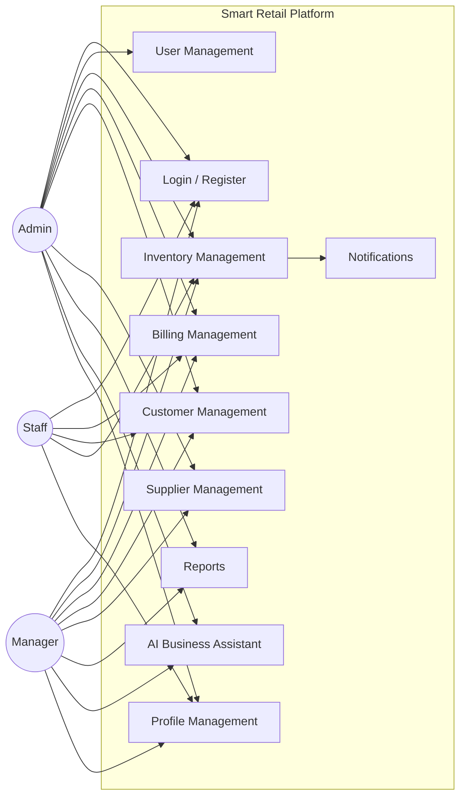
```mermaid
flowchart LR

    Admin((Admin))
    Manager((Manager))
    Staff((Staff))

    subgraph System["Smart Retail Platform"]

        Login["Login / Register"]
        Users["User Management"]
        Inventory["Inventory Management"]
        Billing["Billing Management"]
        Customers["Customer Management"]
        Suppliers["Supplier Management"]
        Reports["Reports"]
        AI["AI Business Assistant"]
        Profile["Profile Management"]
        Notifications["Notifications"]

    end

    Admin --> Login
    Admin --> Users
    Admin --> Inventory
    Admin --> Billing
    Admin --> Customers
    Admin --> Suppliers
    Admin --> Reports
    Admin --> AI
    Admin --> Profile

    Manager --> Login
    Manager --> Inventory
    Manager --> Billing
    Manager --> Customers
    Manager --> Suppliers
    Manager --> Reports
    Manager --> AI
    Manager --> Profile

    Staff --> Login
    Staff --> Billing
    Staff --> Customers
    Staff --> Inventory
    Staff --> Profile

    Inventory --> Notifications
```

---

# 2. High-Level System Architecture

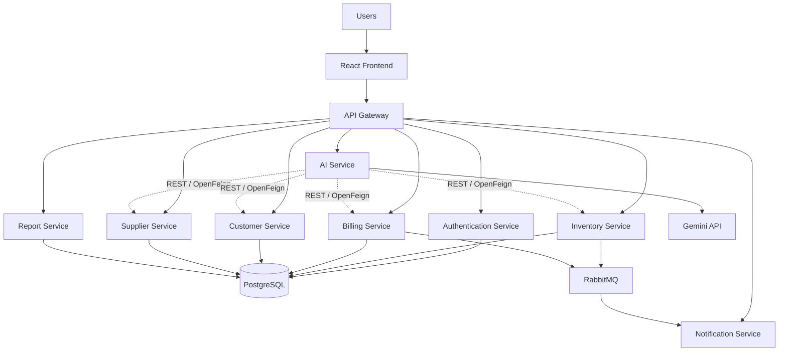
```mermaid
flowchart TB

    User["Users"]

    Frontend["React Frontend"]

    Gateway["API Gateway"]

    Auth["Authentication Service"]
    Inventory["Inventory Service"]
    Billing["Billing Service"]
    Customer["Customer Service"]
    Supplier["Supplier Service"]
    AI["AI Service"]
    Notification["Notification Service"]
    Report["Report Service"]

    Database[(PostgreSQL)]

    RabbitMQ["RabbitMQ"]

    Gemini["Gemini API"]

    User --> Frontend
    Frontend --> Gateway

    Gateway --> Auth
    Gateway --> Inventory
    Gateway --> Billing
    Gateway --> Customer
    Gateway --> Supplier
    Gateway --> AI
    Gateway --> Notification
    Gateway --> Report

    Auth --> Database
    Inventory --> Database
    Billing --> Database
    Customer --> Database
    Supplier --> Database
    Report --> Database

    Inventory --> RabbitMQ
    Billing --> RabbitMQ
    RabbitMQ --> Notification

    AI --> Gemini

    AI -. REST / OpenFeign .-> Inventory
    AI -. REST / OpenFeign .-> Billing
    AI -. REST / OpenFeign .-> Supplier
    AI -. REST / OpenFeign .-> Customer
```

---

# 3. Component Diagram

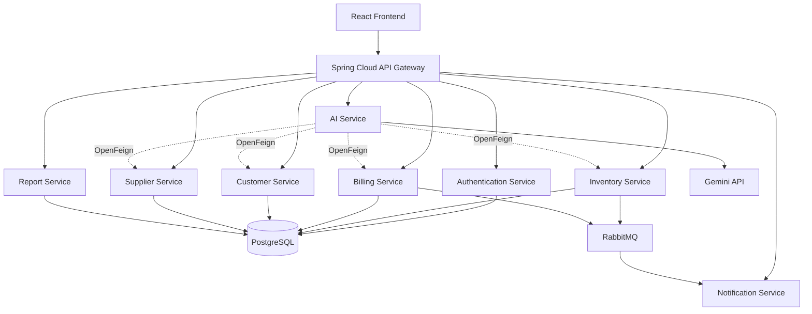
```mermaid
flowchart TB

    Frontend["React Frontend"]

    Gateway["Spring Cloud API Gateway"]

    Auth["Authentication Service"]

    Inventory["Inventory Service"]

    Billing["Billing Service"]

    Customer["Customer Service"]

    Supplier["Supplier Service"]

    AI["AI Service"]

    Report["Report Service"]

    Notification["Notification Service"]

    Database[(PostgreSQL)]

    RabbitMQ["RabbitMQ"]

    Gemini["Gemini API"]

    Frontend --> Gateway

    Gateway --> Auth
    Gateway --> Inventory
    Gateway --> Billing
    Gateway --> Customer
    Gateway --> Supplier
    Gateway --> AI
    Gateway --> Report
    Gateway --> Notification

    Auth --> Database
    Inventory --> Database
    Billing --> Database
    Customer --> Database
    Supplier --> Database
    Report --> Database

    Inventory --> RabbitMQ
    Billing --> RabbitMQ
    RabbitMQ --> Notification

    AI --> Gemini

    AI -. OpenFeign .-> Inventory
    AI -. OpenFeign .-> Billing
    AI -. OpenFeign .-> Supplier
    AI -. OpenFeign .-> Customer
```

---

# 4. Class Diagram

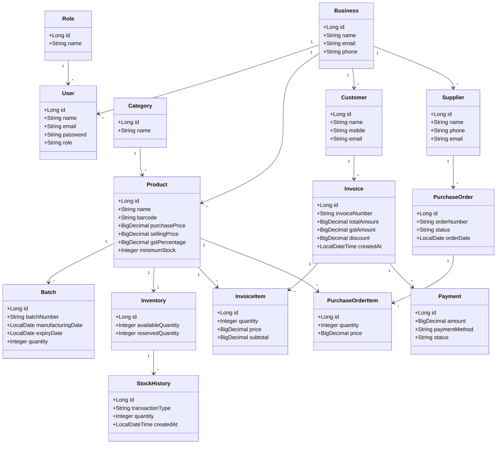
```mermaid
classDiagram

    class Business {
        +Long id
        +String name
        +String email
        +String phone
    }

    class User {
        +Long id
        +String name
        +String email
        +String password
        +String role
    }

    class Role {
        +Long id
        +String name
    }

    class Category {
        +Long id
        +String name
    }

    class Product {
        +Long id
        +String name
        +String barcode
        +BigDecimal purchasePrice
        +BigDecimal sellingPrice
        +BigDecimal gstPercentage
        +Integer minimumStock
    }

    class Batch {
        +Long id
        +String batchNumber
        +LocalDate manufacturingDate
        +LocalDate expiryDate
        +Integer quantity
    }

    class Inventory {
        +Long id
        +Integer availableQuantity
        +Integer reservedQuantity
    }

    class StockHistory {
        +Long id
        +String transactionType
        +Integer quantity
        +LocalDateTime createdAt
    }

    class Customer {
        +Long id
        +String name
        +String mobile
        +String email
    }

    class Invoice {
        +Long id
        +String invoiceNumber
        +BigDecimal totalAmount
        +BigDecimal gstAmount
        +BigDecimal discount
        +LocalDateTime createdAt
    }

    class InvoiceItem {
        +Long id
        +Integer quantity
        +BigDecimal price
        +BigDecimal subtotal
    }

    class Payment {
        +Long id
        +BigDecimal amount
        +String paymentMethod
        +String status
    }

    class Supplier {
        +Long id
        +String name
        +String phone
        +String email
    }

    class PurchaseOrder {
        +Long id
        +String orderNumber
        +String status
        +LocalDate orderDate
    }

    class PurchaseOrderItem {
        +Long id
        +Integer quantity
        +BigDecimal price
    }

    Business "1" --> "*" User
    Role "1" --> "*" User

    Business "1" --> "*" Product
    Category "1" --> "*" Product

    Product "1" --> "*" Batch
    Product "1" --> "1" Inventory

    Inventory "1" --> "*" StockHistory

    Business "1" --> "*" Customer
    Customer "1" --> "*" Invoice

    Invoice "1" --> "*" InvoiceItem
    Product "1" --> "*" InvoiceItem

    Invoice "1" --> "*" Payment

    Business "1" --> "*" Supplier
    Supplier "1" --> "*" PurchaseOrder

    PurchaseOrder "1" --> "*" PurchaseOrderItem
    Product "1" --> "*" PurchaseOrderItem
```

---

# 5. Entity Relationship Diagram

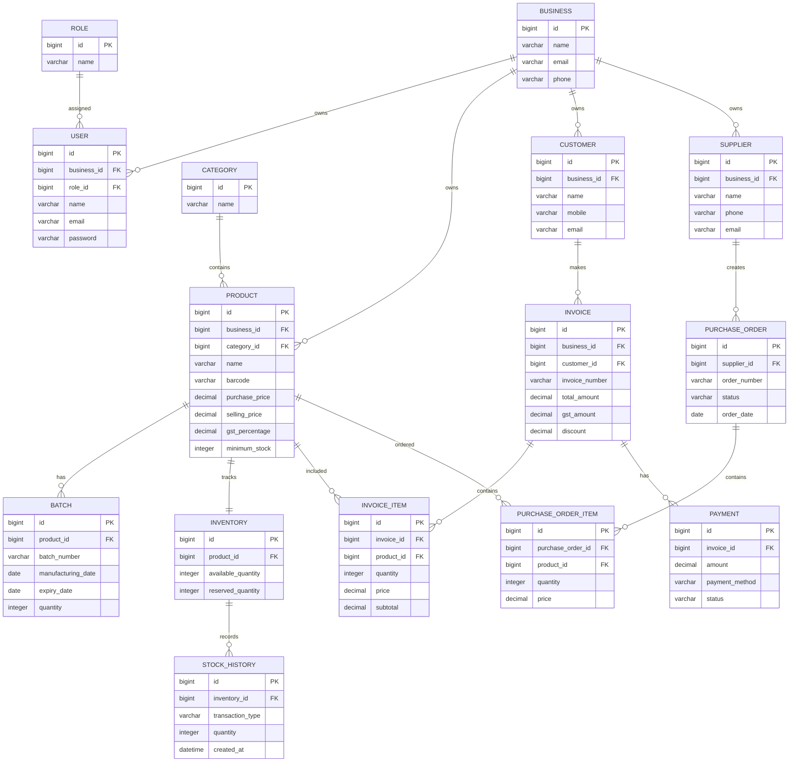
```mermaid
erDiagram

    BUSINESS ||--o{ USER : owns

    ROLE ||--o{ USER : assigned

    BUSINESS ||--o{ PRODUCT : owns

    CATEGORY ||--o{ PRODUCT : contains

    PRODUCT ||--o{ BATCH : has

    PRODUCT ||--|| INVENTORY : tracks

    INVENTORY ||--o{ STOCK_HISTORY : records

    BUSINESS ||--o{ CUSTOMER : owns

    CUSTOMER ||--o{ INVOICE : makes

    INVOICE ||--o{ INVOICE_ITEM : contains

    PRODUCT ||--o{ INVOICE_ITEM : included

    INVOICE ||--o{ PAYMENT : has

    BUSINESS ||--o{ SUPPLIER : owns

    SUPPLIER ||--o{ PURCHASE_ORDER : creates

    PURCHASE_ORDER ||--o{ PURCHASE_ORDER_ITEM : contains

    PRODUCT ||--o{ PURCHASE_ORDER_ITEM : ordered

    BUSINESS {
        bigint id PK
        varchar name
        varchar email
        varchar phone
    }

    USER {
        bigint id PK
        bigint business_id FK
        bigint role_id FK
        varchar name
        varchar email
        varchar password
    }

    ROLE {
        bigint id PK
        varchar name
    }

    CATEGORY {
        bigint id PK
        varchar name
    }

    PRODUCT {
        bigint id PK
        bigint business_id FK
        bigint category_id FK
        varchar name
        varchar barcode
        decimal purchase_price
        decimal selling_price
        decimal gst_percentage
        integer minimum_stock
    }

    BATCH {
        bigint id PK
        bigint product_id FK
        varchar batch_number
        date manufacturing_date
        date expiry_date
        integer quantity
    }

    INVENTORY {
        bigint id PK
        bigint product_id FK
        integer available_quantity
        integer reserved_quantity
    }

    STOCK_HISTORY {
        bigint id PK
        bigint inventory_id FK
        varchar transaction_type
        integer quantity
        datetime created_at
    }

    CUSTOMER {
        bigint id PK
        bigint business_id FK
        varchar name
        varchar mobile
        varchar email
    }

    INVOICE {
        bigint id PK
        bigint business_id FK
        bigint customer_id FK
        varchar invoice_number
        decimal total_amount
        decimal gst_amount
        decimal discount
    }

    INVOICE_ITEM {
        bigint id PK
        bigint invoice_id FK
        bigint product_id FK
        integer quantity
        decimal price
        decimal subtotal
    }

    PAYMENT {
        bigint id PK
        bigint invoice_id FK
        decimal amount
        varchar payment_method
        varchar status
    }

    SUPPLIER {
        bigint id PK
        bigint business_id FK
        varchar name
        varchar phone
        varchar email
    }

    PURCHASE_ORDER {
        bigint id PK
        bigint supplier_id FK
        varchar order_number
        varchar status
        date order_date
    }

    PURCHASE_ORDER_ITEM {
        bigint id PK
        bigint purchase_order_id FK
        bigint product_id FK
        integer quantity
        decimal price
    }
```

---

# 6. Registration Sequence Diagram

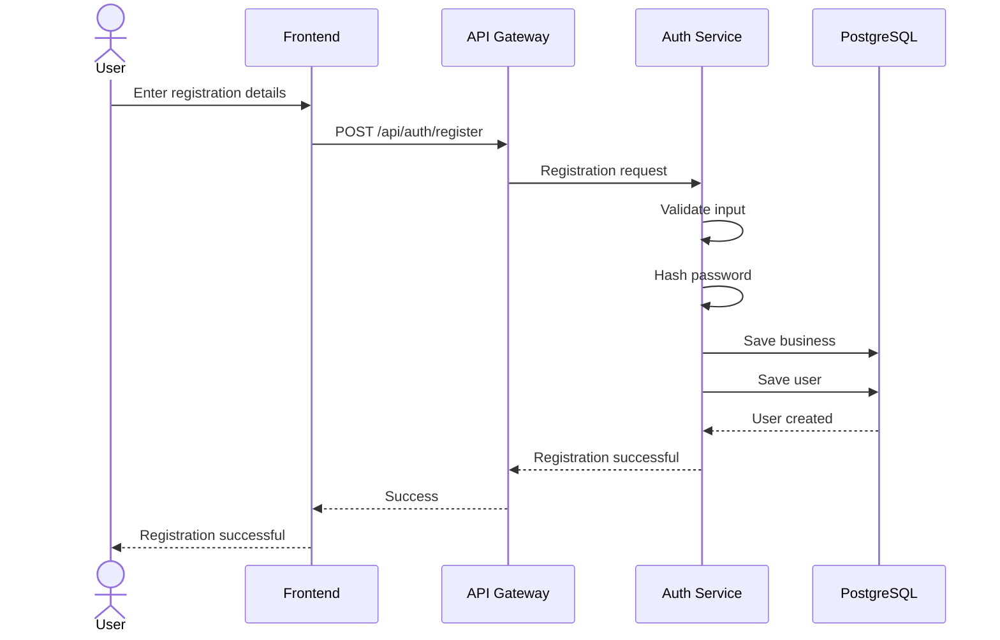
```mermaid
sequenceDiagram

    actor User

    participant Frontend
    participant Gateway as API Gateway
    participant Auth as Auth Service
    participant DB as PostgreSQL

    User->>Frontend: Enter registration details

    Frontend->>Gateway: POST /api/auth/register

    Gateway->>Auth: Registration request

    Auth->>Auth: Validate input

    Auth->>Auth: Hash password

    Auth->>DB: Save business

    Auth->>DB: Save user

    DB-->>Auth: User created

    Auth-->>Gateway: Registration successful

    Gateway-->>Frontend: Success

    Frontend-->>User: Registration successful
```

---

# 7. Login Sequence Diagram

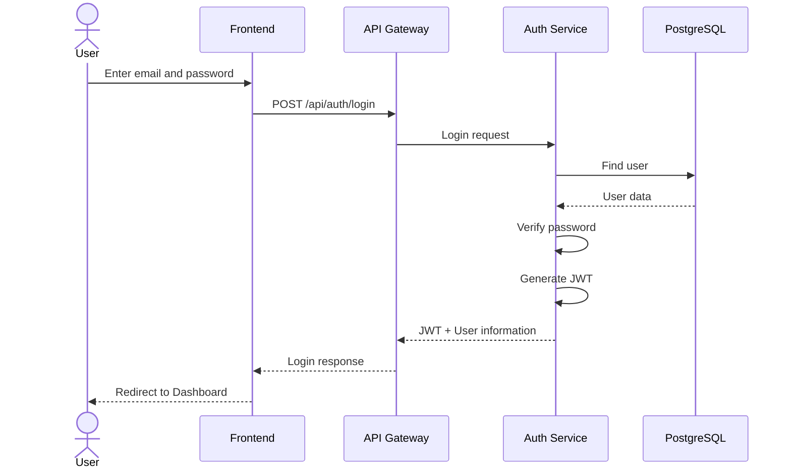
```mermaid
sequenceDiagram

    actor User

    participant Frontend
    participant Gateway as API Gateway
    participant Auth as Auth Service
    participant DB as PostgreSQL

    User->>Frontend: Enter email and password

    Frontend->>Gateway: POST /api/auth/login

    Gateway->>Auth: Login request

    Auth->>DB: Find user

    DB-->>Auth: User data

    Auth->>Auth: Verify password

    Auth->>Auth: Generate JWT

    Auth-->>Gateway: JWT + User information

    Gateway-->>Frontend: Login response

    Frontend-->>User: Redirect to Dashboard
```

---

# 8. JWT Authorization Sequence

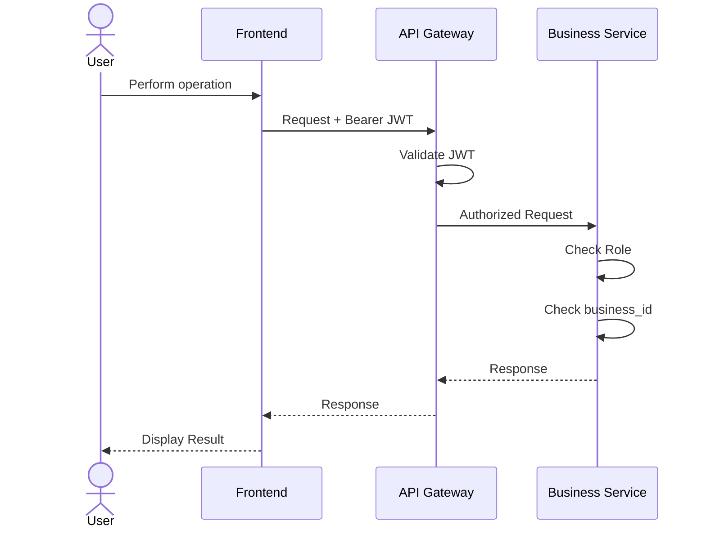
```mermaid
sequenceDiagram

    actor User

    participant Frontend
    participant Gateway as API Gateway
    participant Service as Business Service

    User->>Frontend: Perform operation

    Frontend->>Gateway: Request + Bearer JWT

    Gateway->>Gateway: Validate JWT

    Gateway->>Service: Authorized Request

    Service->>Service: Check Role

    Service->>Service: Check business_id

    Service-->>Gateway: Response

    Gateway-->>Frontend: Response

    Frontend-->>User: Display Result
```

---

# 9. Billing Sequence Diagram

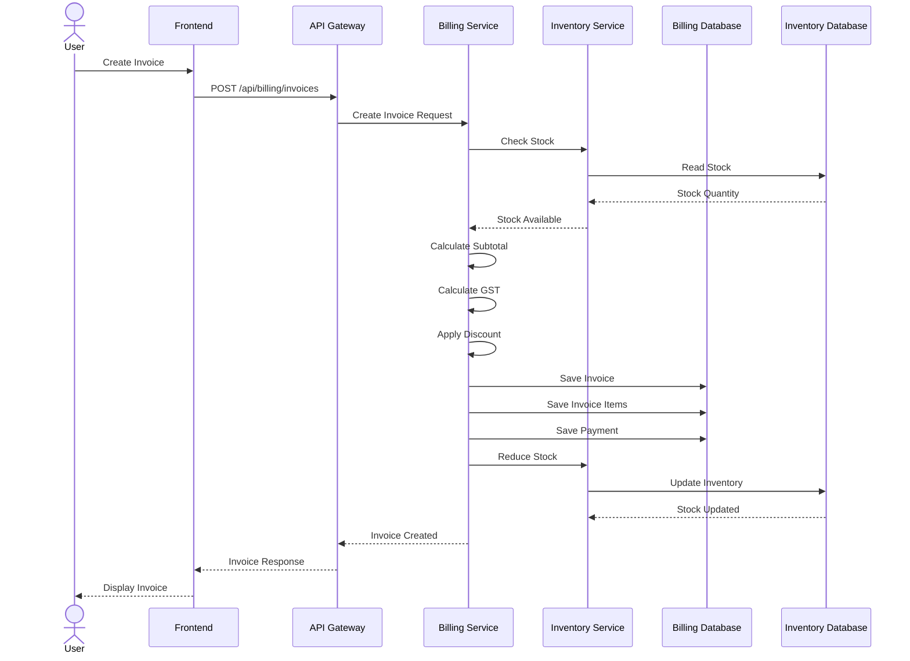
```mermaid
sequenceDiagram

    actor User

    participant Frontend
    participant Gateway as API Gateway
    participant Billing as Billing Service
    participant Inventory as Inventory Service
    participant BillingDB as Billing Database
    participant InventoryDB as Inventory Database

    User->>Frontend: Create Invoice

    Frontend->>Gateway: POST /api/billing/invoices

    Gateway->>Billing: Create Invoice Request

    Billing->>Inventory: Check Stock

    Inventory->>InventoryDB: Read Stock

    InventoryDB-->>Inventory: Stock Quantity

    Inventory-->>Billing: Stock Available

    Billing->>Billing: Calculate Subtotal

    Billing->>Billing: Calculate GST

    Billing->>Billing: Apply Discount

    Billing->>BillingDB: Save Invoice

    Billing->>BillingDB: Save Invoice Items

    Billing->>BillingDB: Save Payment

    Billing->>Inventory: Reduce Stock

    Inventory->>InventoryDB: Update Inventory

    InventoryDB-->>Inventory: Stock Updated

    Billing-->>Gateway: Invoice Created

    Gateway-->>Frontend: Invoice Response

    Frontend-->>User: Display Invoice
```

---

# 10. Inventory Stock-In Sequence

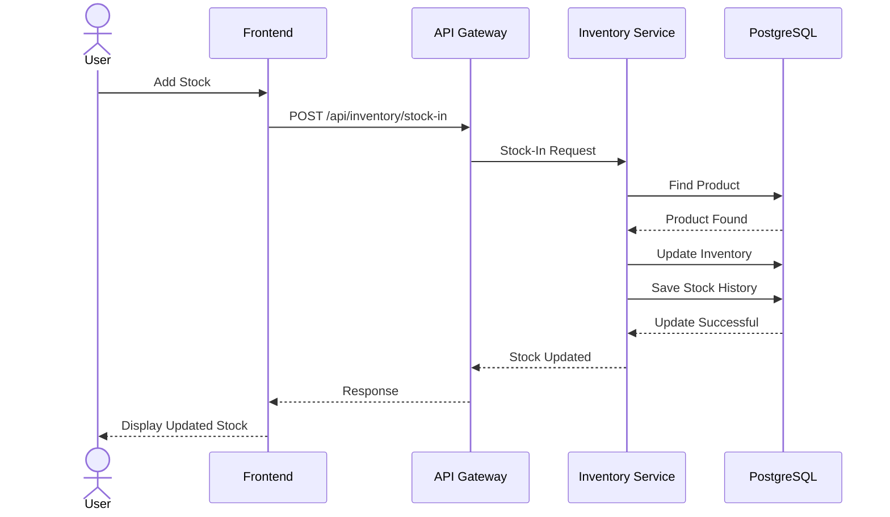
```mermaid
sequenceDiagram

    actor User

    participant Frontend
    participant Gateway as API Gateway
    participant Inventory as Inventory Service
    participant DB as PostgreSQL

    User->>Frontend: Add Stock

    Frontend->>Gateway: POST /api/inventory/stock-in

    Gateway->>Inventory: Stock-In Request

    Inventory->>DB: Find Product

    DB-->>Inventory: Product Found

    Inventory->>DB: Update Inventory

    Inventory->>DB: Save Stock History

    DB-->>Inventory: Update Successful

    Inventory-->>Gateway: Stock Updated

    Gateway-->>Frontend: Response

    Frontend-->>User: Display Updated Stock
```

---

# 11. Inventory Stock-Out Sequence

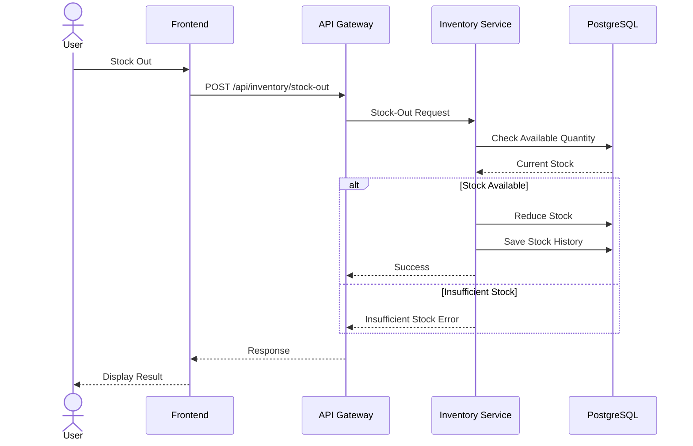
```mermaid
sequenceDiagram

    actor User

    participant Frontend
    participant Gateway as API Gateway
    participant Inventory as Inventory Service
    participant DB as PostgreSQL

    User->>Frontend: Stock Out

    Frontend->>Gateway: POST /api/inventory/stock-out

    Gateway->>Inventory: Stock-Out Request

    Inventory->>DB: Check Available Quantity

    DB-->>Inventory: Current Stock

    alt Stock Available

        Inventory->>DB: Reduce Stock

        Inventory->>DB: Save Stock History

        Inventory-->>Gateway: Success

    else Insufficient Stock

        Inventory-->>Gateway: Insufficient Stock Error

    end

    Gateway-->>Frontend: Response

    Frontend-->>User: Display Result
```

---

# 12. AI Chat Sequence Diagram

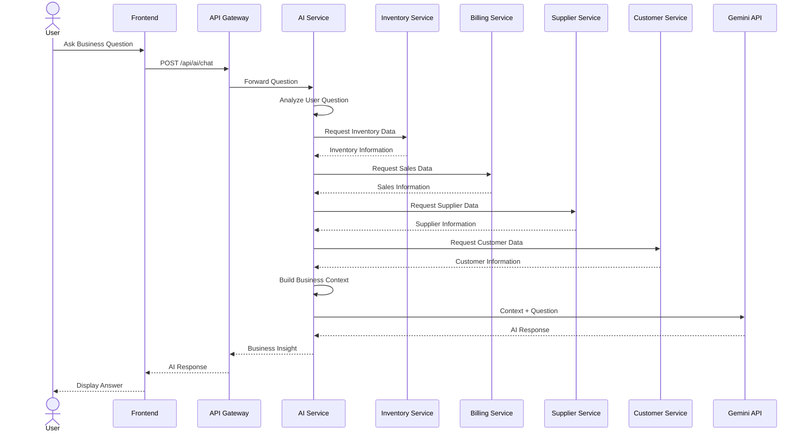
```mermaid
sequenceDiagram

    actor User

    participant Frontend
    participant Gateway as API Gateway
    participant AI as AI Service
    participant Inventory as Inventory Service
    participant Billing as Billing Service
    participant Supplier as Supplier Service
    participant Customer as Customer Service
    participant Gemini as Gemini API

    User->>Frontend: Ask Business Question

    Frontend->>Gateway: POST /api/ai/chat

    Gateway->>AI: Forward Question

    AI->>AI: Analyze User Question

    AI->>Inventory: Request Inventory Data
    Inventory-->>AI: Inventory Information

    AI->>Billing: Request Sales Data
    Billing-->>AI: Sales Information

    AI->>Supplier: Request Supplier Data
    Supplier-->>AI: Supplier Information

    AI->>Customer: Request Customer Data
    Customer-->>AI: Customer Information

    AI->>AI: Build Business Context

    AI->>Gemini: Context + Question

    Gemini-->>AI: AI Response

    AI-->>Gateway: Business Insight

    Gateway-->>Frontend: AI Response

    Frontend-->>User: Display Answer
```

---

# 13. AI Business Intelligence Flow

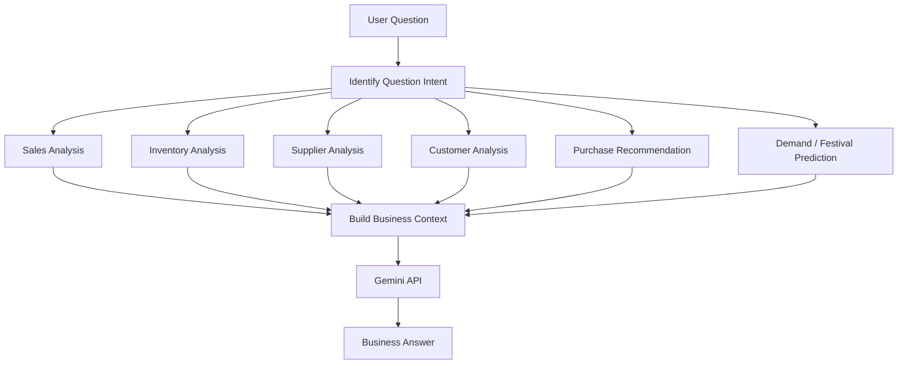
```mermaid
flowchart TD

    Question["User Question"]

    Intent["Identify Question Intent"]

    Sales["Sales Analysis"]
    Inventory["Inventory Analysis"]
    Supplier["Supplier Analysis"]
    Customer["Customer Analysis"]
    Purchase["Purchase Recommendation"]
    Forecast["Demand / Festival Prediction"]

    Context["Build Business Context"]

    Gemini["Gemini API"]

    Answer["Business Answer"]

    Question --> Intent

    Intent --> Sales
    Intent --> Inventory
    Intent --> Supplier
    Intent --> Customer
    Intent --> Purchase
    Intent --> Forecast

    Sales --> Context
    Inventory --> Context
    Supplier --> Context
    Customer --> Context
    Purchase --> Context
    Forecast --> Context

    Context --> Gemini

    Gemini --> Answer
```

---

# 14. Billing Activity Diagram

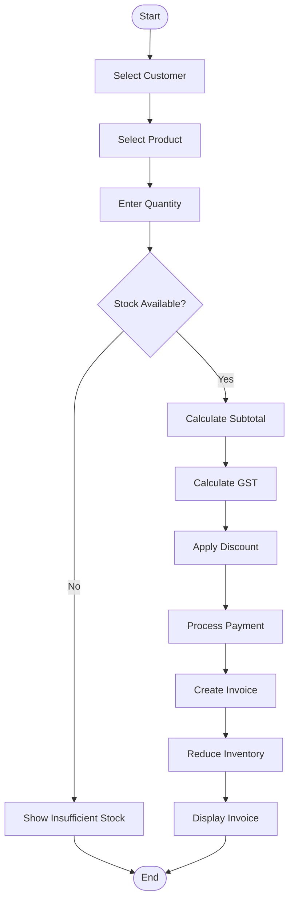
```mermaid
flowchart TD

    Start([Start])

    SelectCustomer["Select Customer"]

    SelectProduct["Select Product"]

    EnterQuantity["Enter Quantity"]

    CheckStock{"Stock Available?"}

    CalculateSubtotal["Calculate Subtotal"]

    CalculateGST["Calculate GST"]

    Discount["Apply Discount"]

    Payment["Process Payment"]

    CreateInvoice["Create Invoice"]

    ReduceStock["Reduce Inventory"]

    Complete["Display Invoice"]

    Error["Show Insufficient Stock"]

    End([End])

    Start --> SelectCustomer
    SelectCustomer --> SelectProduct
    SelectProduct --> EnterQuantity
    EnterQuantity --> CheckStock

    CheckStock -->|Yes| CalculateSubtotal
    CheckStock -->|No| Error

    Error --> End

    CalculateSubtotal --> CalculateGST
    CalculateGST --> Discount
    Discount --> Payment
    Payment --> CreateInvoice
    CreateInvoice --> ReduceStock
    ReduceStock --> Complete
    Complete --> End
```

---

# 15. Inventory Activity Diagram

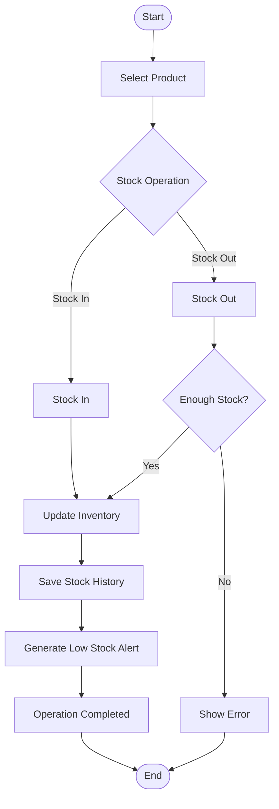
```mermaid
flowchart TD

    Start([Start])

    SelectProduct["Select Product"]

    Operation{"Stock Operation"}

    StockIn["Stock In"]

    StockOut["Stock Out"]

    Check{"Enough Stock?"}

    Update["Update Inventory"]

    History["Save Stock History"]

    Alert["Generate Low Stock Alert"]

    Complete["Operation Completed"]

    Error["Show Error"]

    End([End])

    Start --> SelectProduct

    SelectProduct --> Operation

    Operation -->|Stock In| StockIn
    Operation -->|Stock Out| StockOut

    StockIn --> Update

    StockOut --> Check

    Check -->|Yes| Update
    Check -->|No| Error

    Error --> End

    Update --> History
    History --> Alert
    Alert --> Complete
    Complete --> End
```

---

# 16. AI Activity Diagram

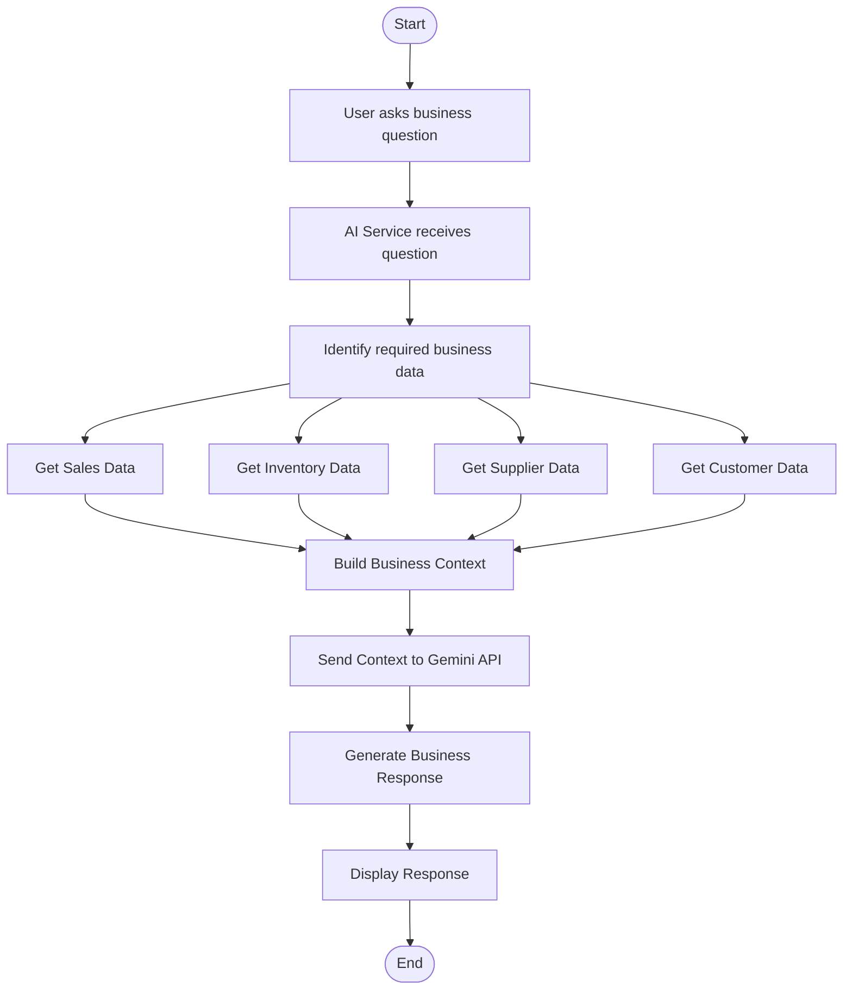
```mermaid
flowchart TD

    Start([Start])

    Question["User asks business question"]

    AIService["AI Service receives question"]

    Identify["Identify required business data"]

    GetSales["Get Sales Data"]

    GetInventory["Get Inventory Data"]

    GetSupplier["Get Supplier Data"]

    GetCustomer["Get Customer Data"]

    Context["Build Business Context"]

    Gemini["Send Context to Gemini API"]

    Response["Generate Business Response"]

    Display["Display Response"]

    End([End])

    Start --> Question
    Question --> AIService
    AIService --> Identify

    Identify --> GetSales
    Identify --> GetInventory
    Identify --> GetSupplier
    Identify --> GetCustomer

    GetSales --> Context
    GetInventory --> Context
    GetSupplier --> Context
    GetCustomer --> Context

    Context --> Gemini
    Gemini --> Response
    Response --> Display
    Display --> End
```

---

# 17. Deployment Diagram

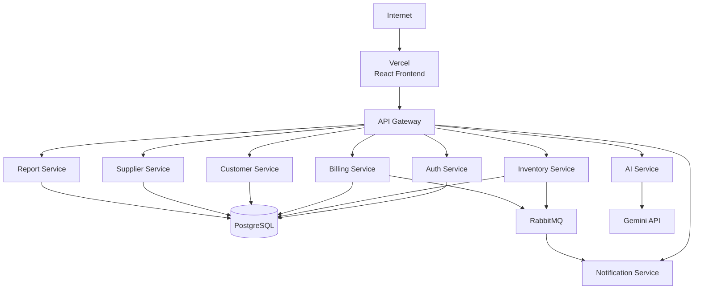
```mermaid
flowchart TB

    Internet["Internet"]

    Frontend["Vercel<br/>React Frontend"]

    Gateway["API Gateway"]

    Auth["Auth Service"]
    Inventory["Inventory Service"]
    Billing["Billing Service"]
    Customer["Customer Service"]
    Supplier["Supplier Service"]
    Report["Report Service"]
    AI["AI Service"]
    Notification["Notification Service"]

    PostgreSQL[(PostgreSQL)]

    RabbitMQ["RabbitMQ"]

    Gemini["Gemini API"]

    Internet --> Frontend

    Frontend --> Gateway

    Gateway --> Auth
    Gateway --> Inventory
    Gateway --> Billing
    Gateway --> Customer
    Gateway --> Supplier
    Gateway --> Report
    Gateway --> AI
    Gateway --> Notification

    Auth --> PostgreSQL
    Inventory --> PostgreSQL
    Billing --> PostgreSQL
    Customer --> PostgreSQL
    Supplier --> PostgreSQL
    Report --> PostgreSQL

    Inventory --> RabbitMQ
    Billing --> RabbitMQ

    RabbitMQ --> Notification

    AI --> Gemini
```

---

# 18. Service Communication Diagram

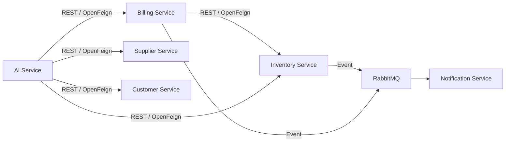
```mermaid
flowchart LR

    Billing["Billing Service"]

    Inventory["Inventory Service"]

    Supplier["Supplier Service"]

    Customer["Customer Service"]

    AI["AI Service"]

    RabbitMQ["RabbitMQ"]

    Notification["Notification Service"]

    Billing -->|REST / OpenFeign| Inventory

    AI -->|REST / OpenFeign| Billing
    AI -->|REST / OpenFeign| Inventory
    AI -->|REST / OpenFeign| Supplier
    AI -->|REST / OpenFeign| Customer

    Inventory -->|Event| RabbitMQ
    Billing -->|Event| RabbitMQ

    RabbitMQ --> Notification
```

---

# 19. Multi-Tenant Data Flow

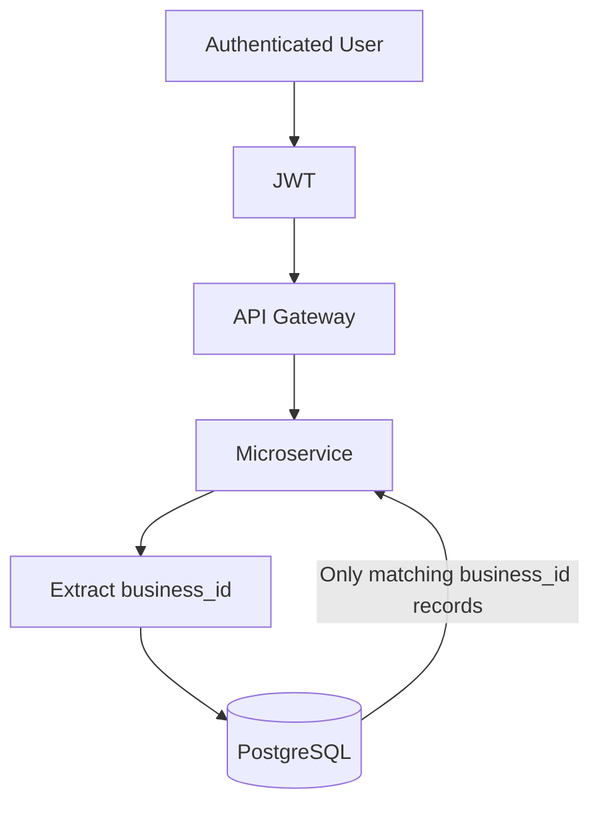
```mermaid
flowchart TD

    User["Authenticated User"]

    JWT["JWT"]

    Gateway["API Gateway"]

    Service["Microservice"]

    Business["Extract business_id"]

    Database[(PostgreSQL)]

    User --> JWT
    JWT --> Gateway
    Gateway --> Service
    Service --> Business
    Business --> Database

    Database -->|Only matching business_id records| Service
```

---

# 20. Concurrent Billing Flow

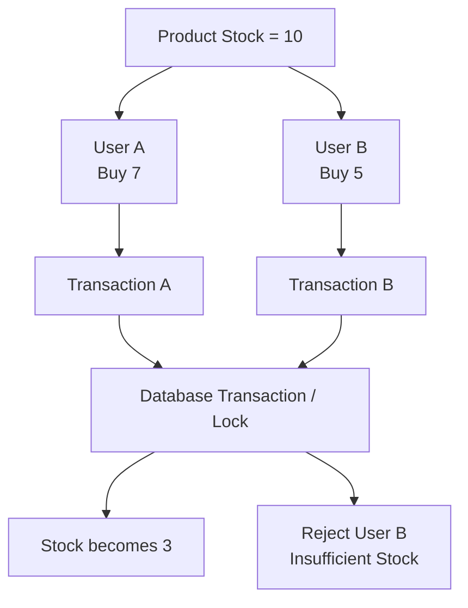
```mermaid


flowchart TD

    Stock["Product Stock = 10"]

    UserA["User A<br/>Buy 7"]

    UserB["User B<br/>Buy 5"]

    TransactionA["Transaction A"]

    TransactionB["Transaction B"]

    Lock["Database Transaction / Lock"]

    UpdateA["Stock becomes 3"]

    RejectB["Reject User B<br/>Insufficient Stock"]

    Stock --> UserA
    Stock --> UserB

    UserA --> TransactionA
    UserB --> TransactionB

    TransactionA --> Lock
    TransactionB --> Lock

    Lock --> UpdateA
    Lock --> RejectB
```

---

# 21. Overall Business Flow

```mermaid
flowchart TD

    Register["Business Registration"]

    Login["User Login"]

    Dashboard["Main Dashboard"]

    Inventory["Inventory"]

    Billing["Billing"]

    Customers["Customers"]

    Suppliers["Suppliers"]

    Reports["Reports"]

    AI["AI Assistant"]

    Insights["Business Insights"]

    Register --> Login

    Login --> Dashboard

    Dashboard --> Inventory
    Dashboard --> Billing
    Dashboard --> Customers
    Dashboard --> Suppliers
    Dashboard --> Reports
    Dashboard --> AI

    Inventory --> Reports
    Billing --> Reports
    Customers --> Reports
    Suppliers --> Reports

    Inventory --> AI
    Billing --> AI
    Suppliers --> AI
    Reports --> AI

    AI --> Insights
```

---

# 22. Complete System Flow

```mermaid
flowchart TB

    User["Business User"]

    Frontend["React Dashboard"]

    Gateway["API Gateway"]

    Auth["Authentication"]

    Inventory["Inventory"]

    Billing["Billing"]

    Customer["Customer"]

    Supplier["Supplier"]

    Reports["Reports"]

    AI["AI Business Intelligence"]

    Notification["Notifications"]

    Database[(PostgreSQL)]

    RabbitMQ["RabbitMQ"]

    Gemini["Gemini API"]

    User --> Frontend

    Frontend --> Gateway

    Gateway --> Auth
    Gateway --> Inventory
    Gateway --> Billing
    Gateway --> Customer
    Gateway --> Supplier
    Gateway --> Reports
    Gateway --> AI
    Gateway --> Notification

    Auth --> Database
    Inventory --> Database
    Billing --> Database
    Customer --> Database
    Supplier --> Database
    Reports --> Database

    Inventory --> RabbitMQ
    Billing --> RabbitMQ

    RabbitMQ --> Notification

    AI --> Inventory
    AI --> Billing
    AI --> Supplier
    AI --> Customer

    AI --> Gemini

    Gemini --> AI

    AI --> Frontend
```

---

# 23. System Module Diagram

```mermaid
flowchart TB

    Dashboard["Smart Retail Dashboard"]

    Dashboard --> Authentication["Authentication"]
    Dashboard --> Inventory["Inventory"]
    Dashboard --> Billing["Billing"]
    Dashboard --> Customers["Customers"]
    Dashboard --> Suppliers["Suppliers"]
    Dashboard --> Reports["Reports"]
    Dashboard --> AI["AI Assistant"]
    Dashboard --> Profile["Profile"]

    Inventory --> Products["Products"]
    Inventory --> Categories["Categories"]
    Inventory --> Stock["Stock"]
    Inventory --> Batch["Batch & Expiry"]

    Billing --> Invoice["Invoice"]
    Billing --> GST["GST"]
    Billing --> Payment["Payment"]

    AI --> Chatbot["AI Chatbot"]
    AI --> Sales["Sales Analysis"]
    AI --> Prediction["Stock Prediction"]
    AI --> Recommendation["Recommendations"]
    AI --> Festival["Festival Prediction"]
```

---

# 24. Final System Architecture

```mermaid
flowchart TB

    User["Users"]

    Frontend["React + Tailwind Frontend"]

    Gateway["Spring Cloud API Gateway"]

    Auth["Authentication Service"]
    Inventory["Inventory Service"]
    Billing["Billing Service"]
    Customer["Customer Service"]
    Supplier["Supplier Service"]
    Reports["Report Service"]
    Notification["Notification Service"]
    AI["AI Business Intelligence Service"]

    DB[(PostgreSQL)]

    RabbitMQ["RabbitMQ"]

    Gemini["Google Gemini API"]

    User --> Frontend

    Frontend --> Gateway

    Gateway --> Auth
    Gateway --> Inventory
    Gateway --> Billing
    Gateway --> Customer
    Gateway --> Supplier
    Gateway --> Reports
    Gateway --> Notification
    Gateway --> AI

    Auth --> DB
    Inventory --> DB
    Billing --> DB
    Customer --> DB
    Supplier --> DB
    Reports --> DB

    Inventory --> RabbitMQ
    Billing --> RabbitMQ

    RabbitMQ --> Notification

    AI --> Inventory
    AI --> Billing
    AI --> Customer
    AI --> Supplier
    AI --> Reports

    AI --> Gemini
    Gemini --> AI
```

---

# 25. Diagram Index

| No. | Diagram                       |
| --- | ----------------------------- |
| 1   | Use Case Diagram              |
| 2   | High-Level Architecture       |
| 3   | Component Diagram             |
| 4   | Class Diagram                 |
| 5   | ER Diagram                    |
| 6   | Registration Sequence         |
| 7   | Login Sequence                |
| 8   | JWT Authorization Sequence    |
| 9   | Billing Sequence              |
| 10  | Inventory Stock-In Sequence   |
| 11  | Inventory Stock-Out Sequence  |
| 12  | AI Chat Sequence              |
| 13  | AI Business Intelligence Flow |
| 14  | Billing Activity Diagram      |
| 15  | Inventory Activity Diagram    |
| 16  | AI Activity Diagram           |
| 17  | Deployment Diagram            |
| 18  | Service Communication         |
| 19  | Multi-Tenant Flow             |
| 20  | Concurrent Billing Flow       |
| 21  | Overall Business Flow         |
| 22  | Complete System Flow          |
| 23  | System Module Diagram         |
| 24  | Final System Architecture     |

---

# Conclusion

The Smart Retail platform uses a scalable microservices architecture with:

```text
React
   +
Spring Boot
   +
Spring Cloud Gateway
   +
JWT Security
   +
PostgreSQL
   +
RabbitMQ
   +
Gemini AI
```

The system is designed to support:

- Multiple businesses
- Multiple users
- Concurrent users
- Secure authentication
- Inventory management
- Billing
- Customers
- Suppliers
- Reports
- Notifications
- AI Business Intelligence
- Horizontal scalability
